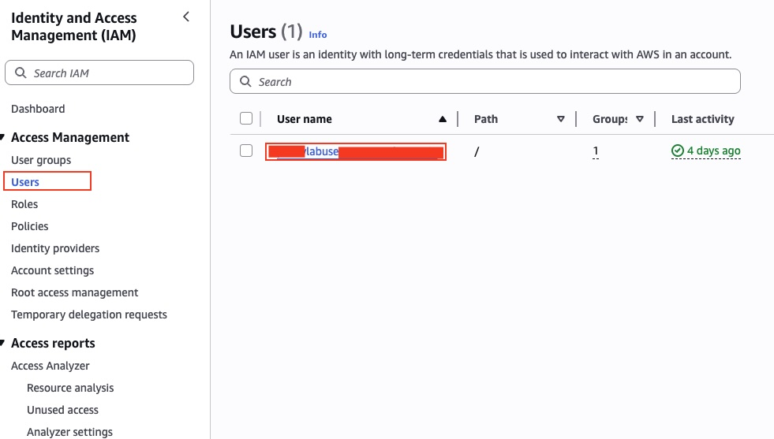
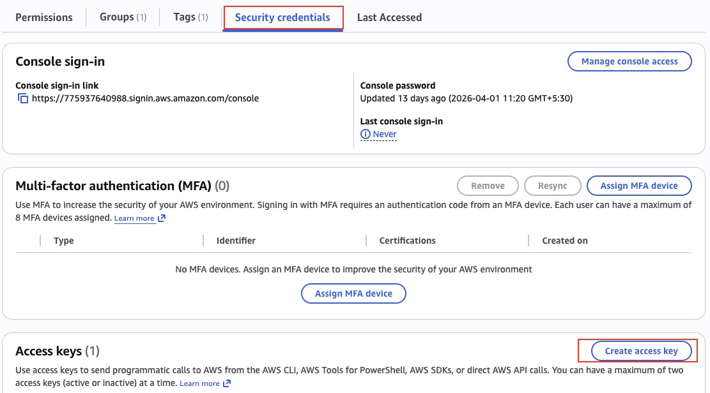
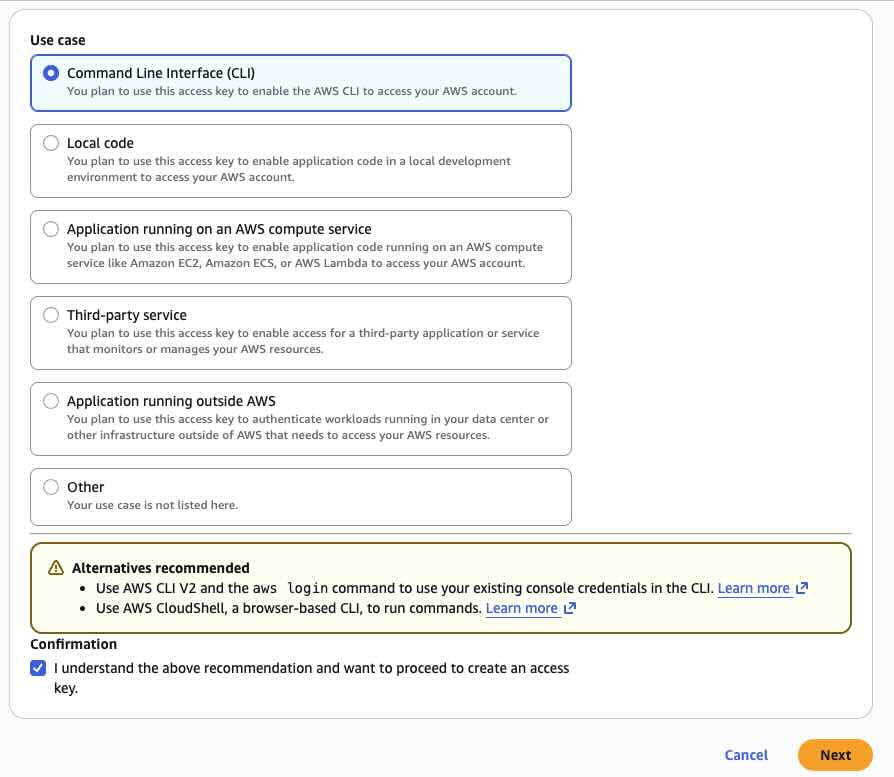

# Set Up Docker and Git

We'll use lots of tools in the course and they each have their own dependencies and configuration. To simplify we'll use Docker containers to run all the components, so you don't need to install a ton of software.

You don’t need any prior Docker experience for this course, everything is automated through scripts. Just follow the steps below:

## Step 1: Access IAM in AWS
1. Log in to your AWS account.
2. From the AWS Console, search for and open the **IAM** service.
3. In the left-hand menu, click on **Users**.
4. From the list on the right, select your **username**.



---

## Step 2: Create Access Keys
5. Go to the **Security credentials** tab.
6. Click on **Create access key**.



7. Choose **Command Line Interface (CLI)** as the use case.
8. Check the confirmation box and click **Next**.



9. (Optional) Add a description tag for the key.
10. Click **Create access key**.

---

## Step 3: Save Your Credentials
11. Once the access key is generated, download the CSV file.  
   *(This contains your credentials. Store it securely.)*

---

## Step 4: Configure AWS CLI
12. Install the AWS CLI on your machine.
13. After installation, run the following command and provide your credentials from the CSV:

```bash
aws configure
```

---

## Step 5: Run the Setup Script

14. Open the setup script and update any required values (e.g., `AWS_ACCOUNT_ID`).
15. Run the provisioning script to create your lab environment:

```bash
bash setup/provision-lab-instances.sh
```

This script will automatically create an EC2 instance and install all the necessary tools required for the lab. 

*(At the end of the scipt execution you will also get a secure URL (SSM CONNECT URL) to access the console of the machine.)*


---

## Check your setup

When you have Git and Docker installed you should be able to run these commands and get some output:

```bash
# run the below command to make the docker command work without sudo in your current session
newgrp docker
```

```
git --version
```

Then run:

```
docker version
```
> Make sure you see two sets of results: `Client:` and `Server:`

And then:

```
docker compose version
```

## Clone the Observability repository

```bash
cd $HOME
git clone https://github.com/ashishjuyal/observability.git
cd observability
```